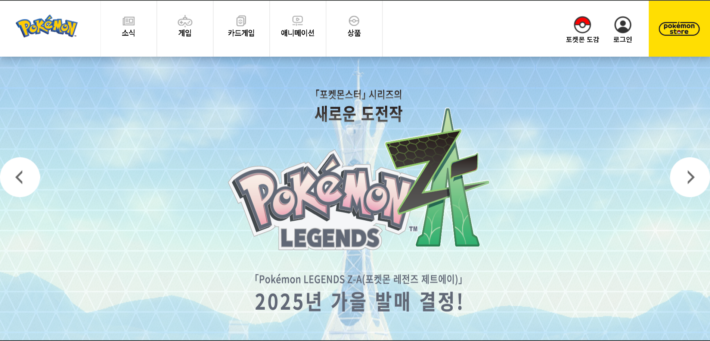

# 🐣 POKEMON 클론 사이트

**🚀 배포 링크**: [클론 사이트 바로가기](https://fluffy-puffpuff-f27c33.netlify.app/)
**🚀 블로그**: [블로그 바로가기](https://blog.naver.com/auroratime020715/223843517704)

React를 이용하여 만들어본 pokemon 클론사이트 입니다.

 
   
 

## 컴포넌트 구성

- header(헤더 컴포넌트)
- visual(무한 스크롤 관리 컴포넌트)
- banner(각 배너를 호버로 다루는 컴포넌트)
- news(새로운 소식을 다루는 컴포넌트)
- game(새로운 게임의 소식을 다루는 컴포넌트)
- product(상품을 관리하는 컴포넌트)
- footer(회사 정보등을 관리하는 바닥글 컴포넌트)

 

## 주요 기능

- 무한 스크롤 버튼 슬라이더
- 각 컴포넌트별 반응형구현
- 각컴포넌트를 각 사이트로 연결

 
